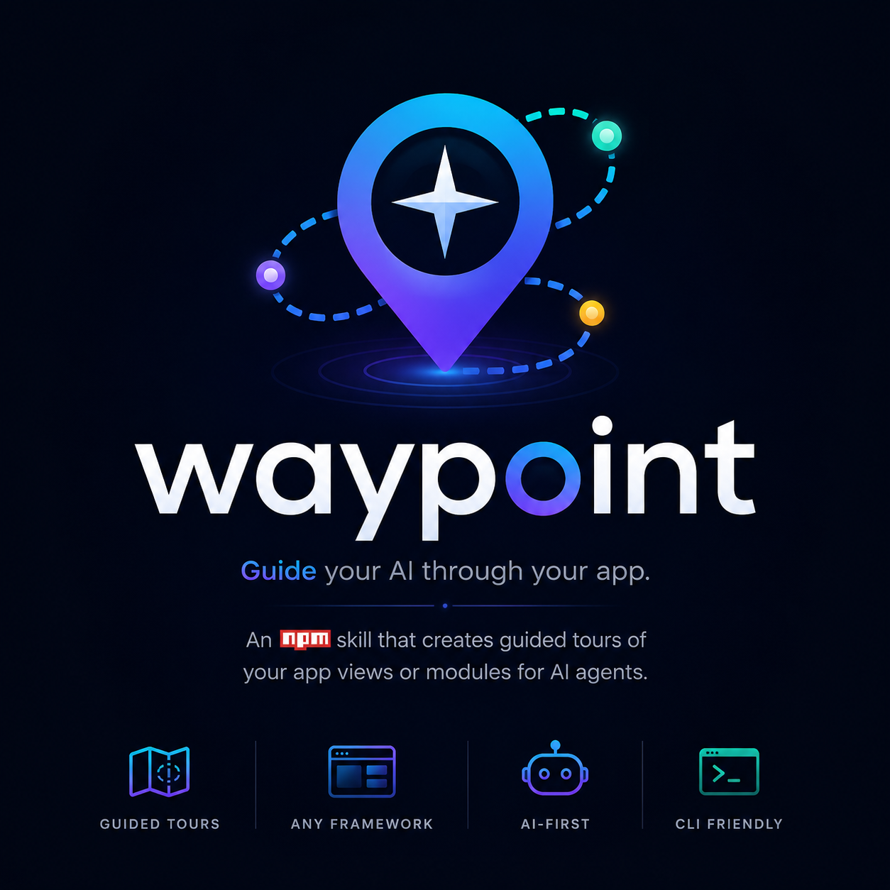

# Waypoint



[](https://www.npmjs.com/package/@waypoint-tours/runtime)
[](https://www.npmjs.com/package/@waypoint-tours/cli)
[](LICENSE)

**Guide your AI through your app.** An npm skill that creates interactive
guided tours of your app's views or modules — written by an AI agent, drawn
by a tiny runtime.

🔗 **[Live demo →](https://jupaorba.github.io/tour-skill/)**

---

## What it is

An AI agent (Claude Code, Cursor, any) **reads your code**, understands the
flow, and produces a `*.tour.json` file. The runtime turns that file into a
step-by-step tutorial with a focus mask, an animated cursor, and tooltips.

You don't write CSS or overlay logic — that already exists. You (or your
agent) just decide the order, grouping, and wording.

---

## Install

```bash
npm install @waypoint-tours/runtime @waypoint-tours/react
npm install -D @waypoint-tours/cli

npx waypoint init
```

`init` adds the right dependencies for your framework, creates `tours/`, and
installs the skill for your agent (`.claude/`, `.cursor/`, or `AGENTS.md`).
It never commits — you review the diff yourself.

---

## Use it in your app

```tsx
import { WaypointProvider, useTour } from '@waypoint-tours/react';
import '@waypoint-tours/runtime/styles.css';
import toursIndex from '../tours/index.json';

// 1. Wrap your app
<WaypointProvider tours={loadTours} locale="en">
  <App />
</WaypointProvider>;

// 2. Start a tour from any button
const { start } = useTour();
<button onClick={() => start('login')}>How does it work?</button>;
```

---

## How it works

Your agent walks this pipeline. Each step is one CLI command:

| Step | Command | Result |
|---|---|---|
| 1 | `npx waypoint discover` | `.tourmap.json` — framework, router, routes → files |
| 2 | `npx waypoint anchor --view=X` | injects `data-tour="x.element"` (idempotent codemod) |
| 3 | `npx waypoint tokens` | `tours/theme.css` from your real design tokens |
| 4 | `npx waypoint verify tours/<id>.tour.json` | walks every step in a **real browser** (Playwright), up to 3 repair cycles |
| 5 | `npx waypoint register` | updates `tours/index.json` |

Between step 3 and 4, the agent writes the `tours/<id>.tour.json` itself.

---

## Example results

This is what Waypoint produces — plain JSON tour files.

### 1. A simple login tour

```jsonc
{
  "id": "login",
  "title": "How to sign in",
  "route": "/login",
  "steps": [
    { "id": "intro", "type": "modal", "body": "Let me show you how to sign in in under a minute." },
    {
      "id": "email",
      "type": "input",
      "title": "Your email",
      "body": "Type the email you signed up with. If there's a typo, we'll flag it right here.",
      "anchor": { "selector": "[data-tour=\"login.email\"]", "strategy": "data-tour" },
      "demoValue": "person@example.com"
    },
    {
      "id": "submit",
      "type": "action",
      "title": "Sign in",
      "body": "Hit sign in. If your details are correct, you'll see your dashboard instantly.",
      "anchor": { "selector": "[data-tour=\"login.submit\"]", "strategy": "data-tour" },
      "sideEffect": "network"
    }
  ],
  "onFinish": { "message": "Done — you know how to sign in now." }
}
```

### 2. A richer tour (grouped fields + modal step)

```jsonc
{
  "id": "new-customer",
  "title": "Add a customer",
  "route": "/customers/new",
  "steps": [
    {
      "id": "contact",
      "type": "group",
      "title": "Contact details",
      "body": "Start with the contact details. The email is where we'll send invoices.",
      "anchors": [
        { "selector": "[data-tour=\"customer.name\"]", "strategy": "data-tour" },
        { "selector": "[data-tour=\"customer.email\"]", "strategy": "data-tour" }
      ]
    },
    {
      "id": "type",
      "type": "input",
      "title": "Person type",
      "body": "Pick Individual or Company. If Company, we'll ask for the legal name.",
      "anchor": { "selector": "[data-tour=\"customer.type\"]", "strategy": "data-tour" },
      "demoValue": "company"
    },
    {
      "id": "save",
      "type": "action",
      "title": "Save the customer",
      "body": "Save. The customer is instantly available for invoicing.",
      "anchor": { "selector": "[data-tour=\"customer.save\"]", "strategy": "data-tour" },
      "sideEffect": "network"
    }
  ],
  "onFinish": { "message": "Done — you know how to add a customer." }
}
```

Step types cover `modal`, `highlight`, `input`, `action`, `await`, `group`,
`navigate`, and `openModal`. See the full schema in
[`packages/skill/schema/tour.schema.json`](packages/skill/schema/tour.schema.json).

---

## Packages

| Package | What it is |
|---|---|
| [`@waypoint-tours/runtime`](packages/runtime) | The engine: mask, cursor, tooltip, state machine. No deps except `@floating-ui/dom`. ≤18 KB gzip. |
| [`@waypoint-tours/react`](packages/react) | `<WaypointProvider>` + `useTour()`. |
| [`@waypoint-tours/vue`](packages/vue) | Plugin + `useTour()` for Vue 3. |
| [`@waypoint-tours/cli`](packages/cli) | `npx waypoint <command>` — discover, anchor, extract tokens, verify in a real browser. |
| [`packages/skill`](packages/skill) | The skill an agent (Claude Code, Cursor, any) uses to generate the `.tour.json` files. |

---

## What it does NOT do (by design)

Native apps · visual editor · session replay · auto translation ·
canvas/iframe/WebGL · A/B testing · overlay SSR.

---

## Local development

```bash
npm install
npm run build
npm run typecheck
npm test        # vitest — pure algorithms + schema validation
npm run size    # 18 KB gzip budget for the runtime
npm run e2e     # Playwright against examples/react-vite-crm

cd examples/react-vite-crm && npm run dev   # run the example app
```

See [`BUILD_PLAN.md`](BUILD_PLAN.md) for interface contracts and critical
algorithms, and [`AGENTS_LOG.md`](AGENTS_LOG.md) for build decisions.

---

## License

MIT © Juan Pablo Ortiz Ballna
